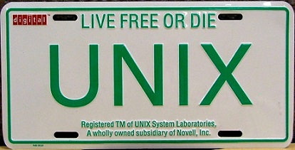

#Week 1: Introduction to Unix#
### Objectives ###

#####By the end of this lesson, you should be able to:######

- Know the basics about the origin of, and the disciplines that contribute to Data Science.
- Understand how to work in a Unix Shell.
- Understand the basic Unix file system and how to create, copy, move, and delete files and directories.

### Activities and Assignments ###

|Activities and Assignments | Time Estimate | Deadline* | Points|
|:------| -----|-------|----------:|
|**[Week 1 Introduction Video][wv]** | 10 Minutes | Tuesday |N/A|
|**[Week 1 Lesson 1: Intro to Data Science](lesson1.md)**| 2 Hours |Thursday| 20|
|**[Week 1 Lesson 2: The Unix Shell](lesson2.md)**| 2 Hours | Thursday | 20 |
|**[Week 1 Lesson 3: The Unix File System](lesson3.md)**| 2 Hours | Thursday| 20 |
|**[Week 1 Quiz][wq]**| 45 Minutes | Friday | 70|

*Please note that unless otherwise noted, the due time is 6pm Central time!

----------

Photo Credit: [Unix License Plate](https://commons.wikimedia.org/wiki/File%3AUNIX-Licence-Plate.JPG) By KHanger, 10 June 2009. Wikipedia. 30 July 2015.

[wv]: https://mediaspace.illinois.edu/media/Week+One/1_zde58qu1/48757791
[wq]: https://learn.illinois.edu/mod/quiz/view.php?id=1629386
