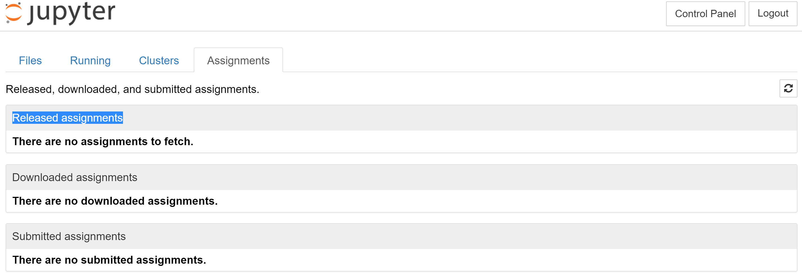

# Week 2 Assignment
## Activating the assignments tab

To view and submit your assignments, you have to use the assignment tab on
the course JupyterHub server. The assignment tab is not activated by default.
You will have to manually activate it. To display the assignment tab,

1. Open a new terminal by clicking `New` in the upper right corner and
   selecting `Terminal`.
   
2. In the terminal, type `nbgrader extension activate` and hit `Enter`. You
   should see 2 `OK`s and `Done.` in the last line of the output. If you see an
   error message, contact the TA.
   
3. Click `Control Panel` in the upper right corner. Click `Stop My Server` and
   wait until the red button disappers. Restart your server by clicking
   `My Server`.
   
4. You should now be able to see the *Assignments* tab after _Files_,
   _Running_, and _Clusters_.
   
5. When assignments are released, it will show up under `Released assignments`.
   

Notes:

- Remember that the assignments on GitHub are for reference only and you should
  use the course JupyterHub server to view, fetch, and submit your assignments.
- You are allowed to submit an assignment *multiple* times. For example, if have
  already submitted an assignment but later realize you made a mistake and want
  to fix it, you can simply change your solution, save the notebook, and submit
  again.
- If you encounter any technical issues, please feel free to contact the
  instructors.

