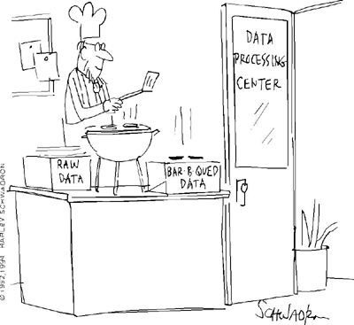

#Week 9 Overview#

## Introduction to Data Formats ##

In this week, you will learn about different data formats. First we will discuss the text data format, which will include the .csv and .txt files. Next, we will discuss JSON files. Finally, we will discuss XML files and how to read and write them.

### Objectives ###

#####By the end of this lesson, you should accomplish the following learning objectives:######

- Understand how to read and write and XML formatted file.
- Understand how to read and write a CSV file.
- Understand how to read and write a JSON file.

### Activities and Assignments ###

|Activities and Assignments | Time Estimate | Deadline* | Points|
|:------| -----|-------|----------:|
|**[Week 9 Introduction Video][w9v]**|15 Minutes|Tuesday|N/A|
|**[Week 9 Lesson 1: Data Format: Text](lesson1.md)**| 2 Hours |Thursday| 20|
|**[Week 9 Lesson 2: Data Format: JSON](lesson2.md)**| 2 Hours | Thursday | 20 |
|**[Week 9 Lesson 3: Data Format: XML](lesson3.md)**| 2 Hours | Thursday| 20 |
|**[Week 9 Quiz][w9q]**| 45 Minutes | Friday | 70|
|**Week 9 Assignment Submission**| 3 Hours | *The following* Monday | 80 from the Instructor, 40 from Peer grading | 
|**Week 9 Completion of Peer Review**| 1 Hour | *The following* Saturday | 30 | 

*Please note that unless otherwise noted, the due time is 6pm Central time!

----------
[w9v]: https://mediaspace.illinois.edu/media/
[w9q]: https://learn.illinois.edu/mod/quiz/view.php?id=1676828

Photo Credit: Data Processing Center.  By Harley Schwadron. From cartoonstock.com.  Accessed 3 August 2015.

